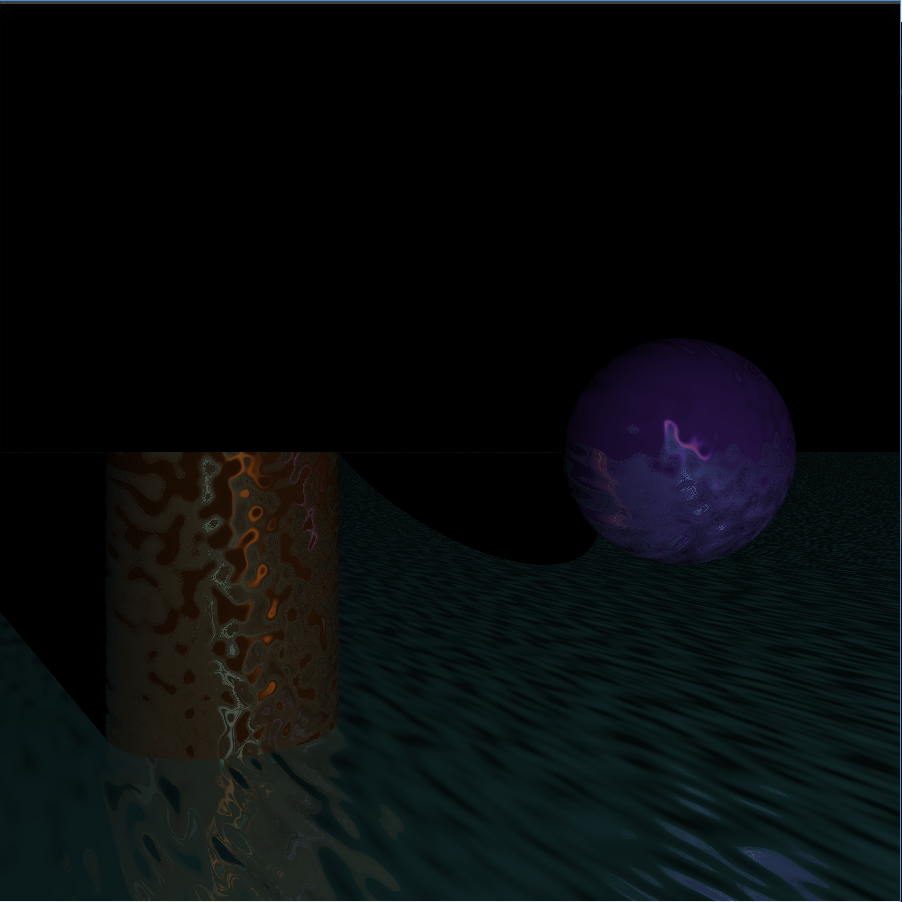
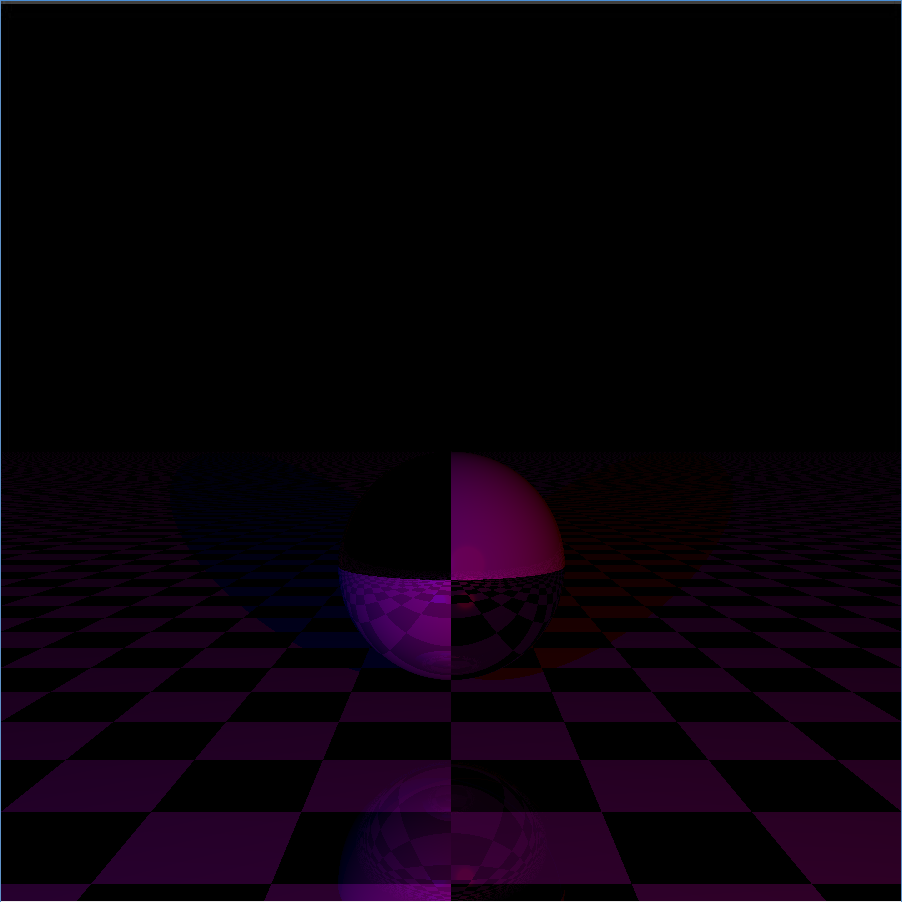
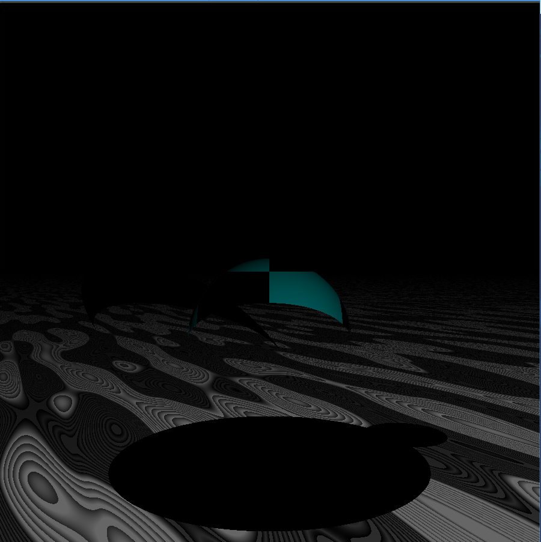
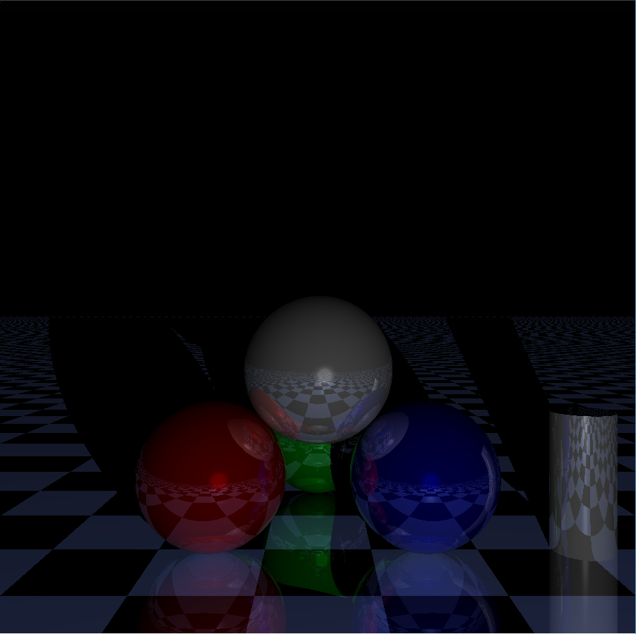
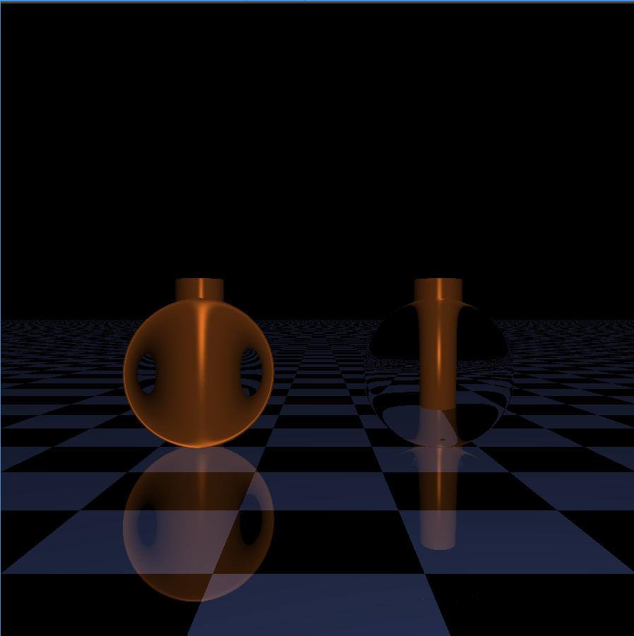

# RaytraCer
Basic raytracing engine written in C for educational purpose. It does not use any functions from the standard library except malloc and free.

## Features

* Camera
* Colored lights
* Object primitives (plan, sphere, cylinder, cone, blob)
* Negative objects
* Reflection
* Refraction
* Bump mapping
* Cellshading
* Perlin noise
* Graphical tool
* JPEG export

## Scenes

## Installation

1. Install [minilibx](https://github.com/dannywillems/minilibx) inside /usr/X11/lib
2. Install [libjpeg](http://libjpeg.sourceforge.net/) inside /usr/X11/lib
3. `make`
4. `./rt scenes/*`
